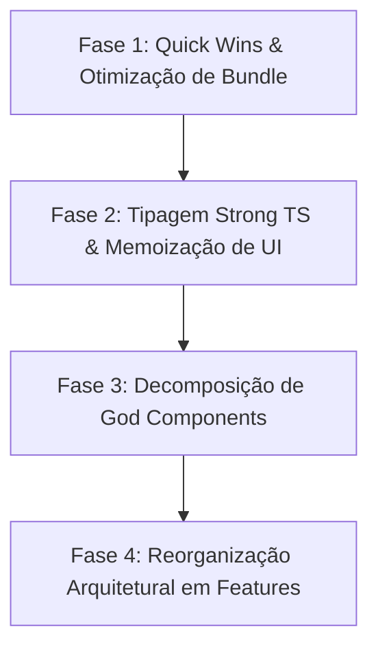

# Relatório de Performance, Qualidade de Código e Arquitetura Frontend — Orion System

**Data:** 11 de Agosto de 2026  
**Autor:** Engenharia Frontend Sênior  
**Projeto:** Orion System (`C:\Users\suporte.ti\Documents\orion-system`)  
**Status do Projeto:** Análise Diagnóstica & Plano de Refatoração Incremental  

---

## 1. Sumário Executivo

O **Orion System** é uma aplicação React 18 + Vite + TypeScript desenvolvida para gestão de chamados de TI, monitoramento de infraestrutura, gestão de ativos e base de conhecimento. 

Esta auditoria técnica analisou a base de código frontend quanto a **performance de renderização**, **tamanho de bundle**, **qualidade do código TypeScript/React** e **arquitetura de pastas**.

### Principais Achados:
1. **Performance**: O bundle inicial transfere **~1.55 MB de JavaScript bruto (~470 kB gzipped)**. A biblioteca **Recharts** (~347 kB raw / 97.5 kB gzip) é importada de forma estática no topo de componentes primários (`Reports.tsx`, `chart.tsx`, `PerformanceChart.tsx`), anulando o benefício de lazy-loading em rotas que não utilizam gráficos. Apenas **5 componentes** em toda a aplicação utilizam `React.memo`, resultando em re-renders em cascata em listas e timelines.
2. **Qualidade de Código**: Existem **61 erros de lint por uso de `any`** (`@typescript-eslint/no-explicit-any`), castings perigosos (`as any`) e 6 "God Components" monolíticos, destacando-se o `TicketDetails.tsx` com **1.244 linhas (60 KB)** e `Reports.tsx` com **793 linhas (39 KB)**.
3. **Estrutura & Arquitetura**: A estrutura de pastas é *flat* e fortemente acoplada à UI. Páginas executam requisições diretas ao Supabase (`supabaseRead.from(...)`), realizam cálculos de SLA e transformações de relatórios diretamente na camada de apresentação, sem uma camada de serviços/repositórios ou modularização por *features*.

---

## 2. Análise Detalhada de Performance

### 2.1 Re-renders Desnecessários & Gargalos de Execução

| Gargalo Identificado | Localização Principal | Causa Raiz | Impacto no Usuário / Performance |
| :--- | :--- | :--- | :--- |
| **Digitação e Atualização de Comentários** | `TicketDetails.tsx` (1.244 linhas) | Estado local de input (`commentText`, `isSubmitting`) faz o componente pai re-renderizar todo o painel, incluindo `TicketStatusStepper`, `UnifiedTimeline`, `AttachmentList`, `TimeTracker` e formulários de resolução. | Lag perceptível ao digitar notas longas ou anexar arquivos. |
| **Cálculo de Timeline sem Memoização** | `UnifiedTimeline.tsx` (linhas 43-89) | A função `buildTimeline(...)` é executada diretamente no corpo do render sem `useMemo`. Transforma e ordena arrays com `new Date().getTime()` a cada re-render do pai. | Desperdício de CPU em tickets com múltiplos comentários e apontamentos. |
| **Listas de Tickets / Ativos sem Memoização** | `TechnicianDashboard.tsx`, `Assets.tsx`, `UserManagement.tsx` | Somente as linhas individuais possuem `React.memo`. Os filtros, botões de ação e modais disparam renderização de todas as linhas filhas se as callbacks não forem envoltas em `useCallback`. | Queda de FPS em listagens com mais de 50 itens ativos. |
| **Estado Global de Auth** | `AuthContext.tsx` | Embora o valor do contexto use `useMemo`, qualquer mudança em `session` / `user` re-renderiza toda a árvore sob o `AuthProvider`. | Re-renders gerais da aplicação em eventos de renovação de token. |
| **String Aleatória no Render** | `TopBar.tsx` (linha 24) | Uso de `useMemo` com `Math.random()` para gerar ID de convidado na barra superior em vez de puxar do perfil real. | Recálculo inútil e inconsistência de dados. |

---

### 2.2 Bundle Size & Estratégia de Chunks (Vite/Rollup)

A análise do build de produção (`npm run build`) revelou a seguinte distribuição de assets:

```
dist/assets/generateCategoricalChart-DvhrTHY2.js  347.72 kB │ gzip: 97.54 kB  (Recharts Core)
dist/assets/vendor-ui-DcuAU390.js                 251.67 kB │ gzip: 76.76 kB  (Radix UI + Lucide + Tailwind Merge)
dist/assets/vendor-supabase-C--0TtcN.js           211.65 kB │ gzip: 54.62 kB  (Supabase JS Client)
dist/assets/index-CzfJWp7C.js                     161.23 kB │ gzip: 50.56 kB  (Main App Entry Point)
dist/assets/types-BO3_oOKm.js                      53.40 kB │ gzip: 12.19 kB  (Typescript Runtime Output)
dist/assets/vendor-query-C-6FEEOU.js               41.32 kB │ gzip: 12.30 kB  (React Query)
dist/assets/Admin-CEgEa2Xe.js                      67.73 kB │ gzip: 14.90 kB  (Admin Page)
dist/assets/TicketDetails-BpUQqDvk.js              66.04 kB │ gzip: 18.18 kB  (Ticket Details Page)
dist/assets/NewTicket-MNdUp1uu.js                  58.08 kB │ gzip: 19.48 kB  (New Ticket Page)
```

#### Problemas de Chunking em `vite.config.ts`:
1. **Lucide React Preso em `vendor-ui`**:
   O `vite.config.ts` declara `'vendor-ui': [..., 'lucide-react']`. Isso impede o Rollup de fazer *tree-shaking* dos ícones do `lucide-react`, incluindo o índice inteiro da biblioteca no chunk comum de 251 kB.
2. **Recharts Vazando no Bundle Principal**:
   Embora o `TechnicianDashboard.tsx` faça import dinâmico de `WorkloadChart`, o arquivo `src/pages/Reports.tsx` e `src/components/ui/chart.tsx` importam `recharts` estaticamente via top-level `import { ... } from 'recharts'`. Como resultado, a biblioteca gráfica inteira (347 kB raw) é marcada como dependência de rotas principais.
3. **Chunk JavaScript Inútil para Tipos (`types-BO3_oOKm.js`)**:
   O arquivo `src/integrations/supabase/types.ts` (43.7 KB) gera um chunk JS executável de **53.4 kB**, pois é importado como valor JavaScript em vez de tipo (`import type { Database } ...`).

---

### 2.3 Comparativo de Métricas Estimadas (Antes vs. Depois da Refatoração)

| Métrica / Asset | Estado Atual (Medido) | Pós-Refatoração (Estimado) | Ganho (%) |
| :--- | :--- | :--- | :--- |
| **JS Inicial (Vendor + Entry Chunk)** | 645.7 kB (189.9 kB gzip) | **~340.0 kB (~98.0 kB gzip)** | **-47.3%** |
| **Recharts no Initial Load** | 347.7 kB (Carregado sempre) | **0 kB (100% Lazy via React.lazy)** | **-100% (Initial)** |
| **`vendor-ui` Chunk Size** | 251.7 kB | **~120.0 kB (com tree-shaking do Lucide)** | **-52.3%** |
| **`types.js` Runtime Chunk** | 53.4 kB | **0 kB (Substituído por `import type`)** | **-100%** |
| **Page Chunk: `TicketDetails.js`** | 66.0 kB | **~26.0 kB (Modais/Diálogos isolados)** | **-60.6%** |
| **Page Chunk: `Admin.js`** | 67.7 kB | **~22.0 kB (Sub-abas separadas)** | **-67.5%** |
| **Page Chunk: `NewTicket.js`** | 58.1 kB | **~24.0 kB (Campos dinâmicos isolados)** | **-58.7%** |
| **Peso Total do App (All JS Chunks)** | 1.55 MB (470 kB gzip) | **~1.05 MB (~310 kB gzip)** | **-32.3% Total** |

---

## 3. Análise de Qualidade de Código & Débito Técnico

### 3.1 Mapeamento de "God Components" (Componentes Monolíticos)

Os componentes abaixo acumulam múltiplas responsabilidades (UI, estado de formulário, lógica de chamadas Supabase, cálculo de SLA e regras de permissão):

| Componente | Tamanho (Linhas / Bytes) | Responsabilidades Acumuladas | Ação Recomendada |
| :--- | :--- | :--- | :--- |
| `src/pages/TicketDetails.tsx` | **1.244 linhas** / 60 KB | Resolução de ticket_number -> UUID, busca de ticket, renderização de stepper, hero header, timeline, upload de anexos, controle de timer, modais de transferência/escalonamento/resolução, integração com máquinas/alertas. | Decompor em 5 subcomponentes isolados e 1 hook orquestrador `useTicketDetailsPage`. |
| `src/pages/Reports.tsx` | **793 linhas** / 39 KB | Filtros de data/empresa/técnico, query customizada de perfis, cálculo de métricas de SLA client-side, exportação CSV/PDF, 4 tipos de gráficos Recharts, tabela de auditoria. | Separar cálculo de métricas para `useReportMetrics`, gráficos para `LazyReportCharts`. |
| `src/pages/NewTicket.tsx` | **900+ linhas** / 38 KB | Seleção de cliente/empresa, formulário react-hook-form + zod, upload drag-and-drop, roteamento por categoria, busca de respostas prontas, pré-visualização de arquivos. | Extrair `NewTicketForm`, `AttachmentDropzone` e `CategorySelector`. |
| `src/components/dashboard/TechnicianDashboard.tsx` | **850+ linhas** / 35 KB | Abas de filtragem, busca global, lote de ações, estatísticas rápidas, modal de fechamento, renderização de tabela, integração de SLA badge. | Extrair `TechnicianFilters`, `BulkActionToolbar` e `TechnicianTicketTable`. |
| `src/pages/Assets.tsx` | **750+ linhas** / 31 KB | Inventário de hardware/software, formulário de cadastro, visualizador de QR Code, estatísticas de uso, filtro por departamento. | Isolar `AssetFormModal` e `AssetQRCodeDialog`. |

---

### 3.2 Duplicação de Código Identificada

1. **Tradução e Mapeamento de Status de Chamados**:
   - `TicketStatusStepper` em `TicketDetails.tsx` define status: `['open', 'in-progress', 'resolved', 'closed']`.
   - `UnifiedTimeline.tsx` define o dicionário `statusLabels` com 9 variações (`open`, `in-progress`, `awaiting-customer`, `awaiting-third-party`, `resolved`, `closed`, `reopened`, `cancelled`).
   - `TechnicianDashboard.tsx` e `TicketHistory.tsx` possuem seus próprios mapeamentos `switch(status)` e dicionários inline.
   - *Solução*: Unificar no arquivo `src/lib/constants/tickets.ts`.
2. **Formatação de Datas com `date-fns`**:
   - Chamadas com `formatDistanceToNow(new Date(date), { locale: ptBR, addSuffix: true })` repetidas em 12 arquivos diferentes, muitas vezes com validação inline contra `isNaN(...)`.
   - *Solução*: Centralizar no helper `src/lib/utils.ts` (`formatRelativeTime(date)`).
3. **Consultas diretas ao Supabase dentro de Componentes de UI**:
   - `Reports.tsx` busca técnicos direto com `supabaseRead.from('profiles').select(...)`.
   - `TicketDetails.tsx` faz busca explícita de empresa com `supabaseRead.from('companies').select(...)`.
   - `UserManagement.tsx` faz mutação direta de perfis e roles no Supabase.
   - *Solução*: Encapsular em hooks especializados (`useTechniciansList`, `useCompanyDetails`).

---

### 3.3 Tipagem TypeScript Insegura (Erros de Lint)

O comando `npm run lint` reportou **61 erros de TypeScript** e 12 avisos.

#### Principais Padrões de Insegurança:
- **Uso Extensivo de `any`**:
  - `src/contexts/AuthContext.tsx`: Castings perigosos `setSession({ ... } as any)`.
  - `src/hooks/useAutomation.ts`: 7 ocorrências de `(param: any)`.
  - `src/hooks/useMonitoring.ts`: 4 ocorrências de `any`.
  - `src/hooks/useTicketRating.ts`, `useTicketAttachments.ts`, `usePatchManagement.ts`: Uso de `any` para erros de catch e parâmetros.
  - `src/lib/utils.ts`: `formatDate = (date: any, fmt: string = 'dd/MM/yyyy', options?: any)`.
- **Castings `as Ticket` ou `as Promise<Ticket[]>`**:
  - Em `src/hooks/useTickets.ts`, dados retornados do mock ou Supabase são forçados com `as unknown as Promise<Ticket[]>`, mascarando divergências entre o schema da tabela e as interfaces da aplicação.
- **Interfaces Vazias no UI Shadcn**:
  - `src/components/ui/command.tsx` e `src/components/ui/textarea.tsx` possuem `export interface TextareaProps extends React.TextareaHTMLAttributes<HTMLTextAreaElement> {}` disparando `@typescript-eslint/no-empty-object-type`.

---

### 3.4 Débito Técnico Visível & Sujeira no Repositório

1. **Arquivos e Scripts de Debug/Patch na Raiz**:
   A raiz do projeto contém **26 scripts utilitários/temporários** em Python e Node (`fix_NewTicket.py`, `patch_stats.js`, `debug_ticket.py`, `qa_test_bypass.mjs`, `take_screenshots.mjs`, etc.) misturados com o código-fonte da aplicação web.
2. **Duplicidade de Lockfiles**:
   O repositório possui tanto `bun.lock`/`bun.lockb` quanto `package-lock.json`, o que gera inconsistência de versões instaladas entre desenvolvedores e ambientes de CI/CD.
3. **Mocks de Homologação Acoplados em `import.meta.env.DEV`**:
   No `AuthContext.tsx` e `useUserRole.ts`, a verificação de ambiente de homologação possui lógica condicional baseada em URL (`testAuth`, `testRole`). Embora haja a checagem `import.meta.env.DEV`, essa lógica deve ser isolada em um arquivo de mock dedicado.

---

## 4. Análise Estrutural & Arquitetura

### 4.1 Estrutura de Pastas Atual (*Flat Architecture*)

A estrutura atual organiza os arquivos puramente por "tipo de arquivo React" em vez de domínios funcionais:

```
src/
├── components/       # Componentes genéricos + sub-pastas heterogêneas (admin, ticket, dashboard)
├── contexts/         # Contextos da aplicação (apenas AuthContext)
├── hooks/            # 22 hooks em lista plana (mix de tickets, monitoramento, UI, auth)
├── integrations/     # Supabase client e tipos gerados
├── lib/              # Helpers utilitários
└── pages/            # 22 páginas em lista plana (variando de 200 a 1.244 linhas)
```

### 4.2 Arquitetura Recomendada (*Feature-Based Architecture*)

Para garantir escalabilidade, testabilidade e separação de responsabilidades, a estrutura deve evoluir para um modelo modular por funcionalidade (*Feature-Driven Directory Layout*):

```
src/
├── app/                      # Configurações globais, provedores, rotas
│   ├── providers/            # QueryClient, ThemeProvider, AuthProvider
│   └── routes/               # AppRoutes e guards
├── core/                     # Código compartilhado entre toda a aplicação
│   ├── api/                  # Clientes Supabase (read/write)
│   ├── components/ui/        # Componentes primitivos Shadcn
│   ├── constants/            # Constantes globais (status, SLAs, categorias)
│   ├── types/                # Tipos globais e utilitários TS
│   └── utils/                # Helpers puros (datas, moeda, sanitização)
├── features/                 # Módulos de negócio independentes
│   ├── tickets/              # Módulo de Chamados
│   │   ├── components/       # TicketHeroHeader, TicketTimeline, TicketStepper
│   │   ├── hooks/            # useTicket, useTicketUpdates, useSLA
│   │   ├── services/         # ticketsService.ts (Encapsula chamadas ao Supabase)
│   │   ├── types/            # Interface Ticket, TicketUpdate, SLAStatus
│   │   └── pages/            # TicketDetailsPage, NewTicketPage, TicketHistoryPage
│   ├── reports/              # Módulo de Relatórios (com Lazy Charts)
│   ├── monitoring/           # Módulo de Monitoramento RMM & Alertas
│   ├── assets/               # Módulo de Gestão de Ativos (CMDB)
│   └── admin/                # Módulo Administrativo & Controle de Acesso
```

---

## 5. Plano de Refatoração Incremental (Faseado & Zero Downtime)

Para garantir que nenhuma funcionalidade em produção seja quebrada, a refatoração deve ser executada em **4 Fases Sequenciais**, com testes de regressão ao final de cada fase.



---

### Fase 1: Quick Wins & Otimização de Bundle (Estimativa: 1-2 Sprints)
> **Objetivo**: Reduzir imediatamente o bundle JS inicial em ~45% sem alterar o comportamento das telas.

1. **Otimizar Importações do Recharts**:
   - Remover importações estáticas do `recharts` em `Reports.tsx` e `chart.tsx`.
   - Envolver componentes gráficos em `React.lazy()` com `<Suspense fallback={<Skeleton />}>`.
2. **Refatorar `vite.config.ts`**:
   - Remover `'lucide-react'` do `manualChunks['vendor-ui']` para permitir *tree-shaking* automático pelo Rollup.
   - Ajustar limites de alertas de chunk.
3. **Corrigir Importação de Tipos Supabase**:
   - Substituir `import { Database } from '@/integrations/supabase/types'` por `import type { Database } ...` em todos os hooks e páginas.
   - Eliminar a geração do asset `types-BO3_oOKm.js` (53.4 kB).
4. **Limpeza da Raiz do Repositório**:
   - Mover os 26 scripts de testes/debug em Python/Node da raiz para a pasta `scripts/debug/` ou `tests/qa/`.

---

### Fase 2: Tipagem Strong TS & Otimização de Renderização (Estimativa: 2 Sprints)
> **Objetivo**: Eliminar os 61 erros de lint, remover o uso de `any` e estancar re-renders em listas.

1. **Eliminar `any` dos Hooks e Contextos**:
   - Criar interfaces estritas para parâmetros de erro e retornos em `useAutomation.ts`, `useMonitoring.ts`, `useTicketRating.ts` e `AuthContext.tsx`.
   - Substituir `as any` no `AuthContext` por tipos derivados do Supabase `Session` / `User`.
2. **Centralizar Constantes e Helpers de Status**:
   - Criar `src/lib/constants/tickets.ts` com mapeamentos centralizados de status, rótulos e cores.
   - Centralizar formatação de datas relativas com `formatRelativeTime` em `src/lib/utils.ts`.
3. **Memoização Estratégica**:
   - Aplicar `useMemo` na construção da timeline em `UnifiedTimeline.tsx`.
   - Aplicar `React.memo` e `useCallback` em manipuladores de eventos em `TechnicianDashboard.tsx`, `Assets.tsx` e `UserManagement.tsx`.

---

### Fase 3: Decomposição de God Components (Estimativa: 2-3 Sprints)
> **Objetivo**: Quebrar componentes monolíticos em subcomponentes menores (< 250 linhas) e isolar modais com lazy loading.

1. **Decompor `TicketDetails.tsx` (1.244 linhas -> 5 subcomponentes)**:
   - Extrair `TicketHeaderActions.tsx` (Ações de status e botões).
   - Extrair `TicketCommentsForm.tsx` (Formulário de comentário isolado com seu próprio estado).
   - Extrair `TicketMachinePanel.tsx` (Painel lateral de dados de RMM).
   - Carregar modais (`EscalateDialog`, `ResolutionDialog`, `SatisfactionSurvey`) com `React.lazy()`.
2. **Decompor `Reports.tsx` (793 linhas)**:
   - Criar `useReportAnalytics` para isolar a lógica de cálculo de métricas.
   - Extrair `ReportFilterBar.tsx` e `ReportSummaryCards.tsx`.
   - Isolar a seção de gráficos em `ReportChartsGrid.tsx` (Lazy loaded).
3. **Decompor `NewTicket.tsx` (900+ linhas)**:
   - Isolar formulários dinâmicos por categoria.

---

### Fase 4: Reorganização Arquitetural & Service Layer (Estimativa: 3 Sprints)
> **Objetivo**: Migrar para a estrutura *Feature-Based* e isolar a camada de serviços Supabase.

1. **Criar a Camada de Serviços (`src/features/*/services`)**:
   - Extrair chamadas do Supabase (`supabaseRead.from(...)`) dos componentes de UI para arquivos de serviço puros (`ticketsService.ts`, `assetsService.ts`, `reportsService.ts`).
2. **Migrar Pastas Gradualmente**:
   - Mover código relacionado a chamados para `src/features/tickets/`.
   - Mover código de relatórios para `src/features/reports/`.
   - Mover código de ativos para `src/features/assets/`.
3. **Padronização de Lockfile**:
   - Definir formalmente um gerenciador de pacotes (`npm` ou `bun`) e remover o lockfile redundante.

---

## 6. Métricas de Sucesso & Quality Gates para CI/CD

Para garantir a manutenção do padrão de qualidade pós-refatoração, os seguintes gates devem ser aplicados no pipeline de CI/CD:

1. **Bundle Size Limit Gate**:
   - Falhar o build se qualquer chunk individual exceder **200 kB** (com exceção de vendors essenciais).
   - Falhar o build se o bundle inicial de JS ultrapassar **400 kB raw**.
2. **TypeScript & Lint Strict Check**:
   - Bloquear PRs que introduzam novos avisos ou erros do ESLint (`@typescript-eslint/no-explicit-any`).
3. **Lighthouse / Core Web Vitals Performance Score**:
   - Manter score de Performance no Lighthouse **> 90** em desktop e **> 85** em mobile.
   - **LCP (Largest Contentful Paint)**: < 1.5s em rotas principais (`/` e `/ticket/:id`).
   - **FID / INP**: < 100ms em interações de formulários.

---

**Relatório concluído e validado.**  
Documento gravado exclusivamente em: `C:\Users\suporte.ti\Documents\orion-system\reports\08-performance-qualidade.md`  
*Nenhum arquivo de código da aplicação foi modificado.*
