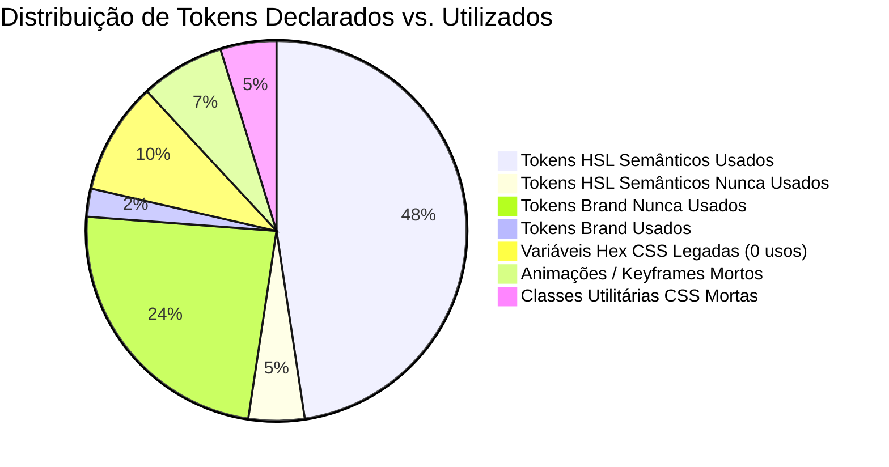
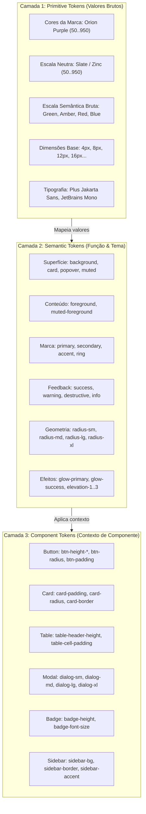

# Relatório de Auditoria de Design System: Tokens & Configuração Base
**Data:** 31 de Agosto de 2026  
**Auditor:** Subagente 1 — Tokens & Configuração Base (Fase 1: Auditoria Read-Only)  
**Arquivos Analisados:** `tailwind.config.ts`, `src/index.css`, `src/lib/utils.ts`, `components.json`, `index.html`, `src/App.css` e varredura estática completa em `src/`.

---

## 1. Sumário Executivo & Diagnóstico Geral

A auditoria de tokens e configuração base do **Orion System** mapeou e inspecionou todos os pontos de definição, consumo e evasão de variáveis de design e utilitários globais na aplicação.

### Principais Indicadores Encontrados:
- **Tokens Semânticos HSL Mapeados:** 14 tokens de cores semânticas + 8 tokens de sidebar em `:root` (Light Mode) e `.dark` (Dark Mode).
- **Escala Primitiva de Marca Declarada:** 11 tons (`brand-50` a `brand-950`).
- **Taxa de Desperdício na Escala Brand:** **90,9%** (10 dos 11 tons declarados em `tailwind.config.ts` nunca foram usados em nenhum arquivo do projeto; apenas `brand-400` possui 1 única ocorrência).
- **Variáveis CSS Órfãs em `src/index.css`:** 4 variáveis hex (`--color-primary`, `--color-primary-dark`, `--color-primary-muted`, `--color-primary-light`) declaradas em `:root` e `.dark`, com **0 utilizações**.
- **Tokens de Componente Inutilizados:** `sidebar-primary` e `sidebar-primary-foreground` declarados no CSS e Tailwind, com **0 utilizações**.
- **Animações / Keyframes Mortos:** `accordion-down` e `accordion-up` configurados no Tailwind mas **sem componente Accordion instalado** e 0 utilizações no código.
- **Classes Utilitárias Órfãs:** `.glass-card` e `.card-hover` em `src/index.css` possuem **0 utilizações** em componentes.
- **Arquivo CSS Inteiramente Morto:** `src/App.css` (43 linhas de boilerplate não importado: `.logo`, `@keyframes logo-spin`, etc.).
- **Ocorrências de Micro-tipografia Hardcoded (`text-[10px]` e `text-[11px]`):** **350+ ocorrências** espalhadas por quase todas as telas do sistema, motivadas pela falta de tokens de tamanho sub-12px na escala do Tailwind.
- **Valores Hex/RGB Hardcoded em Gráficos e Componentes:** **80+ ocorrências** de cores hexadecimais brutas em gráficos Recharts, SVGs e classes arbitrárias.
- **Bug Crítico de Sintaxe CSS Detectado:** Uso de `rgba(var(--primary), ...)` em `Avaliacao.tsx` e `TicketDetails.tsx`, passando valores HSL (`260 43% 33%`) para a função `rgba()`, resultando em regra CSS inválida no navegador.
- **Desconexão de Fontes Monospace:** `JetBrains Mono` e `Geist Mono` constam em `tailwind.config.ts`, mas **não são carregadas no `index.html`**, forçando o uso de fallbacks do sistema.

---

## 2. Inventário Completo de Tokens Declarados

### 2.1. Tokens de Cores HSL (Light Mode vs. Dark Mode)
Declarados em `src/index.css` e mapeados via `hsl(var(--token))` em `tailwind.config.ts`:

| Token CSS | Light Mode (`:root`) | Dark Mode (`.dark`) | Hex Estimado (Light / Dark) | Papel Semântico no Design System | Status de Uso |
| :--- | :--- | :--- | :--- | :--- | :---: |
| `--background` | `220 20% 98%` | `222 24% 9.5%` | `#f7f9fc` / `#12161f` | Fundo principal da aplicação | ✅ Amplo |
| `--foreground` | `224 28% 12%` | `220 15% 96%` | `#161c28` / `#f2f4f8` | Texto principal de alto contraste | ✅ Amplo |
| `--card` | `0 0% 100%` | `222 20% 13.5%` | `#ffffff` / `#1c222c` | Superfícies de cards e painéis | ✅ Amplo |
| `--card-foreground` | `224 28% 12%` | `220 15% 96%` | `#161c28` / `#f2f4f8` | Texto sobre cards | ✅ Amplo |
| `--popover` | `0 0% 100%` | `222 20% 15.5%` | `#ffffff` / `#202733` | Menus flutuantes, popovers e tooltips | ✅ Amplo |
| `--popover-foreground`| `224 28% 12%` | `220 15% 96%` | `#161c28` / `#f2f4f8` | Texto em popovers | ✅ Amplo |
| `--primary` | `260 43% 33%` | `260 60% 56%` | `#483078` / `#7a4bd6` | Cor primária da marca Orion System | ✅ Amplo |
| `--primary-foreground`| `0 0% 100%` | `0 0% 100%` | `#ffffff` / `#ffffff` | Texto em botões e badges primários | ✅ Amplo |
| `--secondary` | `220 14% 94%` | `222 18% 18%` | `#edf0f5` / `#252c38` | Superfícies e botões secundários | ✅ Amplo |
| `--secondary-foreground`| `224 28% 16%` | `220 15% 95%` | `#1d2433` / `#eff1f6` | Texto sobre superfícies secundárias | ✅ Amplo |
| `--muted` | `220 14% 95%` | `222 16% 16%` | `#eff1f5` / `#222731` | Fundo desativado / itens desabilitados | ✅ Amplo |
| `--muted-foreground` | `220 12% 38%` | `220 14% 70%` | `#555f6e` / `#a9b2be` | Texto de apoio, placeholders e metadados | ✅ Amplo |
| `--accent` | `260 25% 92%` | `260 25% 20%` | `#e9e4f0` / `#2a2433` | Destaques sutis e hovers com tom roxo | ✅ Amplo |
| `--accent-foreground`| `260 43% 25%` | `260 60% 80%` | `#37245b` / `#c2abf2` | Texto sobre áreas acentuadas | ✅ Amplo |
| `--destructive` | `0 84% 60%` | `0 75% 55%` | `#f04343` / `#e43535` | Ações perigosas, erros e SLAs violados | ✅ Amplo |
| `--destructive-foreground`| `0 0% 100%` | `0 0% 100%` | `#ffffff` / `#ffffff` | Texto sobre fundos destrutivos | ✅ Amplo |
| `--success` | `142 76% 36%` | `142 70% 42%` | `#16a34a` / `#20b656` | Sucesso, online e métricas no prazo | ⚠️ Parcial* |
| `--success-foreground`| `0 0% 100%` | `0 0% 100%` | `#ffffff` / `#ffffff` | Texto sobre fundo de sucesso | ⚠️ Raro |
| `--warning` | `38 92% 50%` | `38 90% 50%` | `#f59e0b` / `#f59e0b` | Avisos, pendências e SLAs em risco | ⚠️ Parcial* |
| `--warning-foreground`| `224 28% 12%` | `222 24% 9.5%` | `#161c28` / `#12161f` | Texto sobre fundo de warning | ⚠️ Raro |
| `--border` | `220 13% 86%` | `220 16% 22%` | `#d6dce5` / `#2f3642` | Bordas e divisores estruturais | ✅ Amplo |
| `--input` | `220 13% 86%` | `220 16% 22%` | `#d6dce5` / `#2f3642` | Bordas de inputs e controles | ✅ Amplo |
| `--ring` | `260 43% 33%` | `260 60% 56%` | `#483078` / `#7a4bd6` | Anel de foco acessível (WCAG 2.4.7) | ✅ Amplo |

*\*Nota: Os tokens `--success` e `--warning` são usados principalmente de forma direta em gráficos SVG (`fill="hsl(var(--success))"`), mas são frequentemente ignorados em componentes de UI em favor de classes brutas do Tailwind (`emerald-500`, `amber-500`).*

---

### 2.2. Tokens Específicos de Sidebar
Declarados em `src/index.css` e consumidos em `src/components/ui/sidebar.tsx` e `src/components/dashboard/Sidebar.tsx`:

| Token CSS | Light Mode (`:root`) | Dark Mode (`.dark`) | Finalidade | Status de Uso |
| :--- | :--- | :--- | :--- | :--- |
| `--sidebar-background` | `220 18% 97%` | `222 26% 8%` | Fundo do menu lateral | ✅ Ativo |
| `--sidebar-foreground` | `224 20% 28%` | `220 14% 88%` | Texto e ícones na sidebar | ✅ Ativo |
| `--sidebar-primary` | `260 43% 33%` | `260 60% 56%` | Item primário na sidebar | ❌ **0 Usos** |
| `--sidebar-primary-foreground`| `0 0% 100%` | `0 0% 100%` | Texto do item primário | ❌ **0 Usos** |
| `--sidebar-accent` | `220 16% 92%` | `222 20% 14%` | Item em hover / ativo | ✅ Ativo |
| `--sidebar-accent-foreground`| `260 43% 25%` | `220 20% 96%` | Texto em hover / ativo | ✅ Ativo |
| `--sidebar-border` | `220 14% 87%` | `220 16% 18%` | Divisores e borda direita | ✅ Ativo |
| `--sidebar-ring` | `260 43% 33%` | `260 60% 56%` | Anel de foco acessível na sidebar | ✅ Ativo |

---

### 2.3. Variáveis CSS Legadas em Hex (`src/index.css`)
Declaradas no bloco `@layer base` dentro de `:root` e `.dark`:

```css
--color-primary: #483078;
--color-primary-dark: #301860;
--color-primary-muted: #604878;
--color-primary-light: #906090;
```
- **Diagnóstico:** São valores hexadecimais brutos repetidos tanto em `:root` quanto em `.dark`. Não possuem suporte a temas e **não são referenciados em nenhum arquivo da aplicação**. Constituem resquício de prototipação anterior.

---

### 2.4. Escala Primitiva de Marca (`brand-*` em `tailwind.config.ts`)

```typescript
brand: {
  50: '#f8f5fc',
  100: '#efe8f8',
  200: '#ded0f0',
  300: '#c5ade2',
  400: '#906090', // Roxo claro (destaque)
  500: '#604878', // Roxo acinzentado (suporte / interação)
  600: '#483078', // Roxo principal
  700: '#3c246b',
  800: '#301860', // Roxo profundo (base)
  900: '#231148',
  950: '#14092b'
}
```

| Token Tailwind | Valor Hex | Utilização em `src/` | Diagnóstico |
| :--- | :---: | :---: | :--- |
| `brand-50` | `#f8f5fc` | 0 | ❌ Não utilizado |
| `brand-100` | `#efe8f8` | 0 | ❌ Não utilizado |
| `brand-200` | `#ded0f0` | 0 | ❌ Não utilizado |
| `brand-300` | `#c5ade2` | 0 | ❌ Não utilizado |
| `brand-400` | `#906090` | 1 | ⚠️ Utilizado apenas em `PerformanceChart.tsx:29` (`color: 'text-brand-400'`) |
| `brand-500` | `#604878` | 0 | ❌ Não utilizado (em vez disso, usa-se `#604878` hardcoded) |
| `brand-600` | `#483078` | 0 | ❌ Não utilizado (usa-se `bg-primary` ou `#483078`) |
| `brand-700` | `#3c246b` | 0 | ❌ Não utilizado |
| `brand-800` | `#301860` | 0 | ❌ Não utilizado |
| `brand-900` | `#231148` | 0 | ❌ Não utilizado |
| `brand-950` | `#14092b` | 0 | ❌ Não utilizado |

---

### 2.5. Tokens de Raio de Borda (`borderRadius`)

Definidos a partir da variável `--radius: 0.5rem` (8px) em `tailwind.config.ts`:

| Token Tailwind | Valor Calculado | Pixel Equivalente | Utilização |
| :--- | :--- | :---: | :--- |
| `rounded-lg` | `var(--radius)` | `8px` | Utilizado em cards, dropdowns e tabelas. |
| `rounded-md` | `calc(var(--radius) - 2px)` | `6px` | Padrão base dos componentes shadcn/ui (`Button`, `Input`, `Badge`). |
| `rounded-sm` | `calc(var(--radius) - 4px)` | `4px` | Usado em elementos micro (tooltips pequenos, tags). |

**Lacunas Críticas no Sistema de Raio:**
1. O Design System **não possui tokens de raio acima de 8px** vinculados a `--radius`.
2. As classes `rounded-xl` (12px) e `rounded-2xl` (16px) são amplamente utilizadas nos painéis modernos, mas utilizam os valores fixos do Tailwind padrão (`0.75rem` e `1rem`), perdendo o vínculo dinâmico com `--radius`.

---

### 2.6. Keyframes e Animações

| Nome da Animação | Regra de Keyframe | Definição no Tailwind | Ocorrências em `src/` | Status |
| :--- | :--- | :--- | :---: | :---: |
| `accordion-down` | `from { height: 0 } to { height: var(--radix-accordion-content-height) }` | `accordion-down 0.2s ease-out` | 0 | ❌ **Morto** |
| `accordion-up` | `from { height: var(--radix-accordion-content-height) } to { height: 0 }` | `accordion-up 0.2s ease-out` | 0 | ❌ **Morto** |
| `ripple` | `0%, 100% { transform: scale(1) } 50% { transform: scale(0.94) }` | `ripple var(--duration,3s) ease-in-out infinite` | 1 | ✅ Ativo (`modern-animated-sign-in.tsx`) |
| `orbit` | `0% { transform: rotate(0deg) translateY(...) } 100% { rotate(360deg)... }` | `orbit calc(var(--duration)*1s) linear infinite` | 2 | ✅ Ativo (`modern-animated-sign-in.tsx`, `Auth.tsx`) |
| `logo-spin` | `from { transform: rotate(0deg) } to { transform: rotate(360deg) }` | Definido em `src/App.css` | 0 | ❌ **Morto** |

---

### 2.7. Classes Utilitárias Globais (`src/index.css`)

| Classe Utilitária | Definição CSS | Arquivos Consumidores | Status |
| :--- | :--- | :--- | :---: |
| `.capitalize-first` | `&::first-letter { text-transform: uppercase; }` | `SLABadge.tsx:108`, `Reports.tsx:1167` | ✅ Ativo (2 usos) |
| `.glass-card` | `@apply bg-white/80 dark:bg-card/85 backdrop-blur-md border border-border/60 shadow-sm;` | **Nenhum arquivo** | ❌ **0 Usos** |
| `.card-hover` | `@apply transition-all duration-200 hover:-translate-y-0.5 hover:shadow-md hover:border-border/80;` | **Nenhum arquivo** | ❌ **0 Usos** |
| Custom Scrollbars | `::-webkit-scrollbar { width: 7px; height: 7px; }` + `scrollbar-width: thin` | Global (`*`, `html`) | ✅ Ativo |
| Reduced Motion | `@media (prefers-reduced-motion: reduce) { animation-duration: 0.01ms... }` | Global | ✅ Ativo (WCAG 2.3.3) |

---

## 3. Auditoria de Tokens Declarados e Nunca Utilizados (Dead Code)

A análise cruzada entre os arquivos de configuração e o código-fonte revelou um montante significativo de código morto e tokens órfãos:



### Tabela de Elementos Mortos Identificados:

| Categoria | Identificador | Arquivo de Origem | Impacto / Motivo do Desuso |
| :--- | :--- | :--- | :--- |
| **Escala Brand** | `brand-50`, `100`, `200`, `300`, `500`, `600`, `700`, `800`, `900`, `950` | `tailwind.config.ts` (linhas 23-33) | 10 tons da escala nunca foram importados no JSX. O time de frontend usou tokens semânticos (`bg-primary`, `bg-accent`) ou valores hex brutos. |
| **CSS Vars Hex** | `--color-primary`, `--color-primary-dark`, `--color-primary-muted`, `--color-primary-light` | `src/index.css` (linhas 23-26 e 75-78) | Declaradas em `:root` e `.dark` com valores hex repetidos. Não são consumidas pelo Tailwind nem por componentes. |
| **Tokens Sidebar** | `--sidebar-primary`, `--sidebar-primary-foreground` | `src/index.css` (linhas 66-67 e 123-124) | Mapeadas em `tailwind.config.ts`, mas a Sidebar usa `--sidebar-accent` para itens selecionados. |
| **Keyframes** | `accordion-down`, `accordion-up` | `tailwind.config.ts` (linhas 93-108) | Shadcn Accordion não está instalado nem é utilizado no projeto. |
| **Utilitários CSS** | `.glass-card` | `src/index.css` (linha 189) | Efeito de glassmorphism é aplicado ad-hoc em cada componente com classes inline (`bg-background/90 backdrop-blur`). |
| **Utilitários CSS** | `.card-hover` | `src/index.css` (linha 193) | Efeitos de hover em cards são recriados manualmente em cada tela. |
| **Arquivo Estilo** | `src/App.css` (Todo o arquivo) | `src/App.css` (linhas 1-43) | Arquivo template inicial do Vite com 43 linhas (.logo, .read-the-docs, etc.). Não é importado em `main.tsx` nem `App.tsx`. |

---

## 4. Auditoria de Valores Brutos e Hardcoded Sem Token Correspondente

### 4.1. Cores Hex / RGB Hardcoded em Gráficos e Componentes

Identificamos **mais de 80 ocorrências** de cores arbitrárias diretamente inseridas no código. Gráficos de relatórios e telemetria são os maiores focos de evasão de tokens:

| Arquivo | Linha | Valor Hardcoded | Contexto Visual | Token Semântico Recomendado |
| :--- | :---: | :--- | :--- | :--- |
| `PerformanceChart.tsx` | 238, 269, 300 | `#906090` | Linha / Gradiente RAM | `hsl(var(--primary))` ou `--chart-1` |
| `PerformanceChart.tsx` | 248, 273, 313 | `#7c529e` | Linha / Gradiente Disco | `--chart-2` (token de gráfico) |
| `PerformanceChart.tsx` | 258, 277, 326 | `#f59e0b` | Linha / Gradiente Rede | `hsl(var(--warning))` ou `--chart-3` |
| `WebTelemetryTab.tsx` | 487, 528 | `#3b82f6` | Linha / Gradiente Latência | `--chart-blue` ou `hsl(var(--info))` |
| `WebTelemetryTab.tsx` | 491, 537, 567 | `#10b981` | Linha / Gradiente Uptime | `hsl(var(--success))` |
| `Reports.tsx` | 116-124 | `#3b82f6`, `#eab308`, `#f97316`, `#22c55e`, `#64748b`, `#ec4899` | Mapeamento de cores por status de chamado | `STATUS_COLORS` centralizado em tokens |
| `Reports.tsx` | 701-703 | `#22c55e`, `#eab308`, `#ef4444` | Áreas de SLA no Prazo / Atenção / Estourado | `hsl(var(--success))`, `hsl(var(--warning))`, `hsl(var(--destructive))` |
| `Reports.tsx` | 1044-1045 | `#3b82f6`, `#8b5cf6` | Linhas de automação e artigos KB | Tokens semânticos de integração |
| `RemoteTerminal.tsx` | 49, 288 | `#09090b`, `#e4e4e7` | Fundo e texto do terminal Xterm | `--terminal-bg`, `--terminal-fg` |
| `aggregations.ts` | 213-216 | `#ef4444`, `#f97316`, `#eab308`, `#22c55e` | Cores de prioridade (urgente, alta, média, baixa) | Tokens semânticos de prioridade |
| `exportMachinesXlsx.ts`| 22 | `#EFEAF4` | Fundo do cabeçalho Excel | `hsl(var(--accent))` em hex |

---

### 4.2. Bug Crítico: Incompatibilidade de Sintaxe CSS (HSL vs. RGB)

Em dois arquivos, os desenvolvedores tentaram criar sombras luminosas (*glow*) injetando variáveis HSL dentro da função `rgba()` do CSS:

1. **`src/pages/Avaliacao.tsx:133`**:
   ```tsx
   // CÓDIGO ATUAL COM BUG:
   (hoveredRating || rating) >= s 
     ? "fill-primary text-primary drop-shadow-[0_0_8px_rgba(var(--primary),0.5)]" 
     : "text-muted-foreground/30"
   ```
   - **Problema:** `--primary` expande para `260 43% 33%`. A declaração resulta em `rgba(260 43% 33%, 0.5)`, que é **sintaxe CSS inválida** e é silenciosamente descartada pelos navegadores, cancelando o efeito visual.
   - **Solução Correta:** `drop-shadow-[0_0_8px_hsl(var(--primary)/0.5)]` ou criação do utilitário `.glow-primary`.

2. **`src/pages/TicketDetails.tsx:113`**:
   ```tsx
   // CÓDIGO ATUAL COM BUG:
   isActive ? "bg-primary border-primary text-primary-foreground shadow-[0_0_20px_rgba(var(--primary),0.3)] scale-110" : ""
   ```
   - **Problema:** Mesma falha com `shadow-[0_0_20px_rgba(var(--primary),0.3)]`.
   - **Solução Correta:** `shadow-[0_0_20px_hsl(var(--primary)/0.3)]` ou `.glow-lg-primary`.

---

### 4.3. Proliferação de Tipografia Micro (`text-[10px]` e `text-[11px]`)

A ausência de tokens tipográficos para tamanhos menores que `text-xs` (12px) provocou a proliferação desordenada de valores arbitrários:

| Classe Arbitrária | Frequência Aproximada | Casos Típicos de Uso | Impacto / Problema |
| :--- | :---: | :--- | :--- |
| `text-[10px]` | **250+ ocorrências** | Cabeçalhos de tabelas (`uppercase tracking-widest`), badges de status, contadores em sidebar, labels de filtros. | Dificuldade de manutenção e quebra de consistência de line-height. |
| `text-[11px]` | **80+ ocorrências** | Logs de terminal, metadados de máquina (IP, Hostname), cards de patch, cards de saúde da plataforma. | Não alinhado à escala tipográfica padrão do Tailwind. |
| `text-[13px]` | **10+ ocorrências** | Itens de menu e descrições intermediárias. | Cria uma escala paralela não documentada. |

---

### 4.4. Sombras, Brilhos (*Glow*) e Efeitos de Profundidade Arbitrários

Na falta de tokens utilitários para efeitos luminosos e neon, cada tela inventou uma sintaxe própria:

| Sintaxe Utilizada no Código | Arquivo Exemplo | Efeito Pretendido | Token Semântico Sugerido |
| :--- | :--- | :--- | :--- |
| `shadow-[0_0_8px_rgba(245,158,11,0.5)]` | `ContractManagement.tsx:183` | Glow de alerta (amarelo) | `.glow-warning` |
| `shadow-[0_0_8px_rgba(59,130,246,0.3)]` | `ContractManagement.tsx:183` | Glow primário (azul/roxo) | `.glow-primary` |
| `shadow-[0_0_8px_rgba(239,68,68,0.5)]` | `ContractManagement.tsx:182` | Glow destrutivo (vermelho) | `.glow-destructive` |
| `shadow-[0_0_8px_rgba(34,197,94,0.5)]` | `TicketDetails.tsx:1359` | Glow de status online (verde) | `.glow-success` |
| `shadow-[0_2px_10px_hsla(var(--primary),0.2)]` | `Auth.tsx:57` | Glow roxo suave no card | `.glow-sm` |
| `drop-shadow-[0_0_30px_rgba(168,85,247,0.55)]` | `Auth.tsx:486` | Halo roxo brilhante na logo | `.glow-hero` |

---

### 4.5. Z-Index Descentralizado e Sem Escala Semântica

O z-index é aplicado de forma dispersa em valores soltos:
- `z-10`: 12 ocorrências (elementos internos de cards e abas)
- `z-20`: 4 ocorrências (botões flutuantes em cards de dashboard)
- `z-50`: 12 ocorrências (dropdowns, modais, tooltips e alerts)
- `z-[100]`: 1 ocorrência (`toast.tsx`)

**Diagnóstico:** Não há variáveis CSS semânticas de camada (`--z-base`, `--z-dropdown`, `--z-modal`, `--z-toast`, `--z-tooltip`). O uso de `z-[100]` no toast em contraste com `z-50` em modais e sheets funciona por acaso, mas pode gerar sobreposição incorreta caso componentes futuros utilizem `z-50`.

---

### 4.6. Larguras Arbitrárias de Modais e Diálogos

Encontramos **8 larguras distintas** aplicadas manualmente em `DialogContent` e `AlertDialogContent`:

```
sm:max-w-[420px]  (MergeTicketDialog, Notifications)
sm:max-w-[425px]  (UserManagement)
sm:max-w-[500px]  (ResolutionChecklistManagement, EscalateDialog)
sm:max-w-[540px]  (ResolutionDialog)
sm:max-w-[600px]  (RoutingRulesManagement, Assets)
sm:max-w-[620px]  (RulesTab)
sm:max-w-[700px]  (Assets Machine Detail)
sm:max-w-[800px]  (Assets Device Add)
```

---

## 5. Análise da Arquitetura de Tokens: Atual vs. 3 Camadas

A arquitetura recomendada para Design Systems modernos (estilo W3C Design Tokens Community Group / Material 3 / Radix) organiza tokens em 3 camadas com papéis bem delimitados:



### 5.1. Diagnóstico da Arquitetura Atual

| Aspecto | Estado Atual no Orion System | Avaliação | Impacto |
| :--- | :--- | :---: | :--- |
| **Camada 1 (Primitives)** | Parcialmente declarada em `tailwind.config.ts` (`brand: 50..950`), mas totalmente desacoplada das variáveis HSL do CSS. | ⚠️ Fragmentado | A escala de cores primitivas não alimenta os tokens semânticos; são dois mundos isolados. |
| **Camada 2 (Semantics)** | Implementada com padrão Shadcn em HSL (`--primary`, `--background`, `--card`, etc.). Suporta Light/Dark mode. | 🟢 Bom | Falta o token semântico `--info` e tokens de microtipografia (`--text-2xs`, `--text-3xs`). |
| **Camada 3 (Components)** | Existe apenas para `--sidebar-*`. Botões, cards, tabelas e modais não possuem tokens dedicados. | 🔴 Deficiente | Força desenvolvedores a criarem componentes wrappers redundantes (ex: `ButtonPrimary`) ou sobrescreverem classes Tailwind inline (`h-7`, `rounded-xl`, `max-w-[500px]`). |

---

## 6. Proposta de Arquitetura de 3 Camadas para Fase 2

Para consolidar o Design System do Orion System, propomos a seguinte reestruturação na Fase 2:

### 6.1. Reestruturação do `src/index.css`

#### 1. Inclusão dos Tokens Semânticos Faltantes:
```css
:root {
  /* Feedback Semântico Completo */
  --info: 217 91% 60%;
  --info-foreground: 0 0% 100%;

  /* Escala de Raio de Borda Semântico */
  --radius-xs: 0.25rem;  /* 4px */
  --radius-sm: 0.375rem; /* 6px */
  --radius-md: 0.5rem;   /* 8px (base) */
  --radius-lg: 0.75rem;  /* 12px */
  --radius-xl: 1rem;     /* 16px */
  --radius-full: 9999px;

  /* Escala de Camadas (Z-Index) */
  --z-base: 0;
  --z-dropdown: 40;
  --z-sticky: 50;
  --z-modal: 60;
  --z-popover: 70;
  --z-toast: 100;
  --z-tooltip: 110;
}

.dark {
  --info: 217 91% 60%;
  --info-foreground: 0 0% 100%;
}
```

#### 2. Utilitários Globais de Efeitos Luminescentes (*Glows* e *Glass*):
```css
@layer utilities {
  /* Glows com suporte nativo a Dark Mode e cores HSL */
  .glow-primary {
    box-shadow: 0 0 12px hsl(var(--primary) / 0.4);
  }
  .glow-success {
    box-shadow: 0 0 12px hsl(var(--success) / 0.4);
  }
  .glow-warning {
    box-shadow: 0 0 12px hsl(var(--warning) / 0.4);
  }
  .glow-destructive {
    box-shadow: 0 0 12px hsl(var(--destructive) / 0.4);
  }

  /* Microtipografia Oficial */
  .text-2xs {
    font-size: 0.625rem; /* 10px */
    line-height: 0.875rem; /* 14px */
  }
  .text-3xs {
    font-size: 0.5625rem; /* 9px */
    line-height: 0.75rem; /* 12px */
  }
  .text-micro {
    font-size: 0.6875rem; /* 11px */
    line-height: 1rem; /* 16px */
  }
}
```

---

### 6.2. Reestruturação do `tailwind.config.ts`

```typescript
// Adições recomendadas na extensão do tema:
fontSize: {
  '3xs': ['0.5625rem', { lineHeight: '0.75rem' }], // 9px
  '2xs': ['0.625rem', { lineHeight: '0.875rem' }],  // 10px
  'micro': ['0.6875rem', { lineHeight: '1rem' }],   // 11px
},
borderRadius: {
  xs: 'var(--radius-xs)',
  sm: 'calc(var(--radius) - 4px)',
  md: 'calc(var(--radius) - 2px)',
  lg: 'var(--radius)',
  xl: 'calc(var(--radius) + 4px)',
  '2xl': 'calc(var(--radius) + 8px)',
  full: '9999px',
},
colors: {
  // ... tokens existentes ...
  info: {
    DEFAULT: 'hsl(var(--info))',
    foreground: 'hsl(var(--info-foreground))'
  }
}
```

---

### 6.3. Padronização de Larguras de Modais (Component Tokens)

Criar variantes padronizadas no `dialog.tsx`:
- `size="sm"`: `sm:max-w-md` (448px) — Ex: Confirmações, Deletes, Merges.
- `size="default"`: `sm:max-w-lg` (512px) — Ex: Edição de Usuário, Novo Pacote.
- `size="lg"`: `sm:max-w-2xl` (672px) — Ex: Regras de Roteamento, Checklists.
- `size="xl"`: `sm:max-w-4xl` (896px) — Ex: Detalhes de Máquina, Wizard de Dispositivos.

---

## 7. Plano de Ação Priorizado (Próximos Passos)

| Prioridade | Ação | Impacto | Complexidade |
| :---: | :--- | :--- | :---: |
| 🔴 **P0** | **Corrigir bugs de sintaxe HSL em `rgba()`** em `Avaliacao.tsx:133` e `TicketDetails.tsx:113`. | Corrige render quebrado de sombras no navegador. | Mínima (1 linha cada) |
| 🔴 **P0** | **Excluir `src/App.css`** (boilerplate não utilizado) e limpar importações órfãs. | Higiene de código e redução de bundle. | Mínima |
| 🟡 **P1** | **Adicionar tokens de microtipografia (`text-2xs`, `text-micro`)** no Tailwind para substituir as 350+ ocorrências de `text-[10px]` e `text-[11px]`. | Elimina a maior fonte de classes arbitrárias do projeto. | Baixa |
| 🟡 **P1** | **Adicionar token semântico `info` e utilitários de `glow`** em `index.css` e `tailwind.config.ts`. | Unifica alertas azuis, status e efeitos luminosos. | Baixa |
| 🟡 **P1** | **Remover variáveis CSS legadas e keyframes mortos** (`--color-primary-*`, `accordion-down/up`, `glass-card`, `card-hover`). | Reduz débito técnico e confusão entre desenvolvedores. | Baixa |
| 🟢 **P2** | **Carregar a fonte `JetBrains Mono` no `index.html`** para suportar a declaração `fontFamily.mono`. | Garante fidelidade visual e consistência nos blocos de código/IPs. | Baixa |
| 🟢 **P2** | **Padronizar as larguras de `DialogContent`** em 4 tamanhos semânticos (sm, default, lg, xl). | Elimina 8 variações arbitrárias de modais. | Média |
