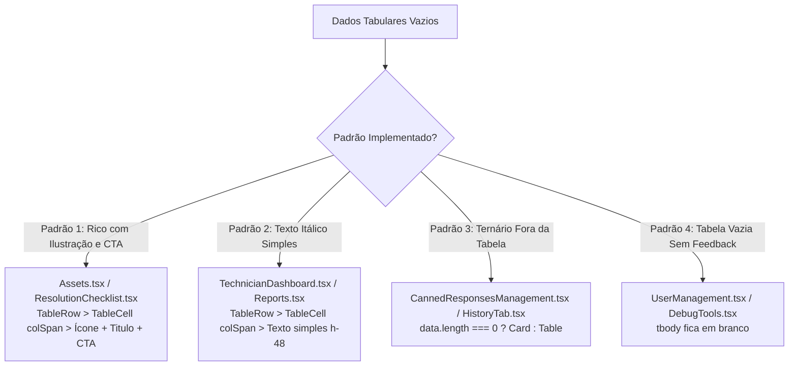

# Auditoria de Design System — Subagente 3: Tabelas e Listagens
**Orion System — Relatório de Consistência e Contratos Visuais (Fase 1 — Read-Only)**
**Data:** 31 de Agosto de 2026  
**Status da Auditoria:** Concluída com Sucesso

---

## 1. Sumário Executivo e Metodologia

Esta auditoria realizou uma varredura estrita e não destrutiva (*read-only*) em todo o código-fonte (`src/`) do **Orion System**, inspecionando todos os componentes e páginas que renderizam dados tabulares e estruturas de listagem repetitiva.

O objetivo central foi mapear o uso do componente padrão `<Table>` do shadcn (`src/components/ui/table.tsx`), identificar onde tabelas foram construídas com `<table>` HTML nativo ou simuladas com CSS Flexbox/Grid, e quantificar as divergências visuais em:
1. **Tipografia e anatomia de cabeçalhos (`TableHeader` / `TableHead`)**
2. **Padding, densidade e altura de linhas (`TableCell` / `TableRow`)**
3. **Bordas, divisores e contraste em modo claro/escuro**
4. **Comportamento e transições de hover**
5. **Padrões de estado vazio (*Empty State*), carregamento (*Loading*) e erro**
6. **Controles de paginação e ordenação (*Sorting*)**

### Principais Constatações
- **14 arquivos** consom diretamente o wrapper `@/components/ui/table`.
- **1 arquivo** utiliza `<table>` HTML cru com estilização Tailwind manual (`InventoryTab.tsx`).
- **6 componentes/páginas** reimplementam listagens de dados em `<Card>` ou flex containers, muitas vezes duplicando a mesma entidade com paradigmas visuais conflitantes (ex: *Respostas Prontas/Templates* e *Regras de Automação/Roteamento*).
- **Inconsistência severa de Tipografia no Cabeçalho:** Foram encontradas **4 escalas de tamanho de fonte** (`text-[9px]`, `text-[10px]`, `text-xs`, `text-sm`), **4 pesos de fonte** (`font-black`, `font-bold`, `font-semibold`, `font-medium`), **3 variações de tracking** (`tracking-widest`, `tracking-wider`, normal) e **4 backgrounds distintos** (`bg-muted/5`, `bg-muted/10`, `bg-muted/30`, sem background).
- **Divergência Crítica de Empty States:** Coexistem 4 abordagens radicalmente diferentes para estados vazios:
  1. `<TableRow><TableCell colSpan={N}>` com ilustração rica, título, subtítulo e CTA (padrão ouro em `Assets.tsx`).
  2. `<TableRow><TableCell colSpan={N}>` com texto simples itálico monocromático (ex: `TechnicianDashboard.tsx`).
  3. Renderização condicional fora da tag `<table>` (ex: `CannedResponsesManagement.tsx`, `HistoryTab.tsx`).
  4. Nenhuma tratativa de estado vazio (linhas simplesmente somem, ex: `UserManagement.tsx`, `DebugTools.tsx`).
- **Ausência Quase Total de Ordenação e Paginação Padrão:** Apenas 1 tabela possui paginação implementada (`TicketHistory.tsx`), enquanto tabelas com centenas de potenciais registros (`Assets.tsx`, `Monitoring.tsx`, `UserManagement.tsx`) dependem de renderização massiva sem paginação. Nenhuma tabela possui suporte a cabeçalhos clicáveis de ordenação (*sort headers*).

---

## 2. Mapeamento Completo de Componentes Tabulares

A tabela a seguir consolida todas as telas e componentes que exibem dados tabulares no sistema.

| # | Arquivo / Componente | Paradigma Utilizado | Colunas | Domínio / Entidade |
|---|----------------------|---------------------|:-------:|-------------------|
| 1 | `src/components/dashboard/TechnicianDashboard.tsx` (Fila / Meus / Todos) | shadcn `<Table>` | 6 a 7 | Chamados Operacionais (Tickets) |
| 2 | `src/components/dashboard/TechnicianDashboard.tsx` (Workload Equipe) | shadcn `<Table>` | 4 | Carga de Trabalho dos Técnicos |
| 3 | `src/pages/Assets.tsx` | shadcn `<Table>` | 7 | Inventário de Dispositivos / CMDB |
| 4 | `src/pages/Monitoring.tsx` (`MachinesTableView`) | shadcn `<Table>` | 5 | RMM: Supervisão de Máquinas |
| 5 | `src/pages/PatchManagement.tsx` | shadcn `<Table>` | 3 | Log de Implantação de Patches |
| 6 | `src/pages/Reports.tsx` (Modo Detalhado) | shadcn `<Table>` | 9 | Relatório Analítico de Chamados |
| 7 | `src/pages/TicketHistory.tsx` (Desktop >= md) | shadcn `<Table>` | 6 | Histórico Geral de Tickets |
| 8 | `src/pages/DebugTools.tsx` (SLA Test) | shadcn `<Table>` | 8 | Diagnóstico de Prazos de SLA |
| 9 | `src/pages/DebugTools.tsx` (Audit Log) | shadcn `<Table>` | 6 | Trilha de Auditoria do Banco |
| 10 | `src/components/admin/CompanyManagement.tsx` (Principal) | shadcn `<Table>` | 7 | Gestão de Empresas Clientes |
| 11 | `src/components/admin/CompanyManagement.tsx` (Modal Tokens) | shadcn `<Table>` | 3 | Chaves de API do Orion Agent |
| 12 | `src/components/admin/ContractManagement.tsx` | shadcn `<Table>` | 7 | Gestão de Contratos e SLAs |
| 13 | `src/components/admin/UserManagement.tsx` | shadcn `<Table>` | 6 | Usuários, Papéis e Perfis |
| 14 | `src/components/admin/CannedResponsesManagement.tsx` | shadcn `<Table>` | 4 | Respostas Prontas (Admin) |
| 15 | `src/components/admin/ResolutionChecklistManagement.tsx` | shadcn `<Table>` | 4 | Checklists de Encerramento |
| 16 | `src/components/admin/RoutingRulesManagement.tsx` | shadcn `<Table>` | 6 | Regras Condicionais de Roteamento |
| 17 | `src/components/automation/HistoryTab.tsx` | shadcn `<Table>` | 4 | Log de Execuções de Automação |
| 18 | `src/components/monitoring/InventoryTab.tsx` | `<table>` HTML Nativo | 4 | Adaptadores & Interfaces de Rede |
| 19 | `src/pages/ClientPortal.tsx` | Cards / Flex Simulado | — | Chamados Ativos do Cliente |
| 20 | `src/components/automation/RulesTab.tsx` | Cards em Lista Vertical | — | Regras de Automação (Mesma entidade que #16) |
| 21 | `src/components/automation/TemplatesTab.tsx` | Cards em Grid 3 Cols | — | Templates de Resposta (Mesma entidade que #14) |
| 22 | `src/components/monitoring/MachineTicketsTab.tsx` | Botões em Lista Stack | — | Tickets Vinculados à Máquina no Drawer |
| 23 | `src/components/monitoring/WebTelemetryTab.tsx` | Cards Divididos em 2 Cols | — | Telemetria de Endpoints e Links |
| 24 | `src/pages/AlertsDashboard.tsx` | Cards em Grid 3 Cols | — | Alertas Críticos da Frota RMM |

---

## 3. Análise Comparativa Sistemática

### 3.1 Estilo do Header (`th` / `TableHead`)

O componente base `src/components/ui/table.tsx` define como padrão do `TableHead`:
```tsx
"h-12 px-4 text-left align-middle font-medium text-muted-foreground [&:has([role=checkbox])]:pr-0"
```
No entanto, quase todas as páginas sobrescrevem esse estilo de forma desordenada:

| Página / Componente | Tamanho Fonte | Transform | Peso (Font Weight) | Tracking | Cor Fundo (Header/Row) | Altura (h) |
|---|:---:|:---:|:---:|:---:|:---:|:---:|
| `TechnicianDashboard.tsx` | `text-[10px]` | `uppercase` | `font-black` (900) | `tracking-widest` | `bg-muted/5` | `h-12` |
| `Assets.tsx` | `text-[10px]` | `uppercase` | `font-semibold` (600) | `tracking-wider` | `bg-muted/30` | `h-12` (default) |
| `Monitoring.tsx` | `text-xs` (12px) | *Normal* | `font-bold` (700) | *Normal* | `bg-muted/30` | `h-12` (default) |
| `PatchManagement.tsx` | `text-[9px]` | `uppercase` | `font-black` (900) | `tracking-widest` | *Sem fundo* | `h-12` (default) |
| `Reports.tsx` | `text-sm` (14px) | *Normal* | `font-medium` (500) | *Normal* | *Sem fundo* | `h-12` (default) |
| `TicketHistory.tsx` | `text-[10px]` | `uppercase` | `font-black` (900) | `tracking-widest` | `bg-muted/5` | `h-11` (44px) |
| `DebugTools.tsx` | `text-sm` (14px) | *Normal* | `font-medium` (500) | *Normal* | *Sem fundo* | `h-12` (default) |
| `CompanyManagement.tsx` | `text-sm` (14px) | *Normal* | `font-medium` (500) | *Normal* | *Sem fundo* | `h-12` (default) |
| `CompanyManagement.tsx` (Tokens) | `text-[10px]` | `uppercase` | `font-black` (900) | *Normal* | `bg-muted/30` | `h-12` (default) |
| `ContractManagement.tsx` | `text-sm` (14px) | *Normal* | `font-medium` (500) | *Normal* | *Sem fundo* | `h-12` (default) |
| `UserManagement.tsx` | `text-sm` (14px) | *Normal* | `font-medium` (500) | *Normal* | *Sem fundo* | `h-12` (default) |
| `CannedResponsesManagement.tsx`| `text-sm` (14px) | *Normal* | `font-medium` (500) | *Normal* | *Sem fundo* | `h-12` (default) |
| `ResolutionChecklist.tsx` | `text-[10px]` | `uppercase` | `font-bold` (700) | `tracking-widest` | `bg-muted/10` | `h-12` (default) |
| `RoutingRulesManagement.tsx` | `text-[10px]` | `uppercase` | `font-bold` (700) | `tracking-widest` | `bg-muted/10` | `h-12` (default) |
| `HistoryTab.tsx` | `text-[10px]` | `uppercase` | `font-black` (900) | `tracking-widest` | `bg-muted/10` | `h-12` (default) |
| `InventoryTab.tsx` (Nativa) | `text-[10px]` | `uppercase` | `font-bold` (700) | `tracking-wider` | `bg-muted/30` | `py-2.5` |

#### Diagnóstico do Header
1. **Dicotomia Brutal entre Telas Operacionais e Admin:** As telas operacionais e analíticas (`TechnicianDashboard`, `TicketHistory`, `Assets`, `HistoryTab`) optaram por cabeçalhos compactos com estilo "micro-badge" (`text-[10px] font-black uppercase tracking-widest`). Já as telas administrativas clássicas (`UserManagement`, `CompanyManagement`, `ContractManagement`, `Reports`) usam a tipografia crua herdada do shadcn (`text-sm font-medium`), gerando a sensação de pertencerem a sistemas visuais diferentes.
2. **Conflito de Pesos e Tracking:** Mesmo dentro do grupo de cabeçalhos compactos, há oscilações injustificadas entre `font-black` (900), `font-bold` (700) e `font-semibold` (600), além de `tracking-widest` vs `tracking-wider`.
3. **Inconsistência de Background:** O `TableHeader` varia de transparente/sem fundo até `bg-muted/5`, `bg-muted/10` e `bg-muted/30`.

---

### 3.2 Padding de Célula e Densidade de Linha (`TableCell` / `TableRow`)

O componente padrão define `p-4 align-middle` (16px em todas as direções).

| Nível de Densidade | Padding Aplicado | Arquivos Onde Ocorre | Altura Média de Linha | Uso Recomendado |
|---|---|---|:---:|---|
| **Compacta** | `px-4 py-2.5` a `px-4 py-3`, `text-xs` | `InventoryTab.tsx`, `PatchManagement.tsx`, `HistoryTab.tsx` | ~38px - 44px | Listas secundárias, modais, logs e drawers |
| **Padrão / Média** | `p-4` (default), `py-3.5 px-4` | `Assets.tsx`, `Monitoring.tsx`, `UserManagement.tsx`, `Reports.tsx` | ~52px - 58px | Tabelas de gestão geral e cadastros |
| **Relaxada / Expansiva** | `py-4 pl-6 pr-6` com múltiplos textos e badges empilhados | `TechnicianDashboard.tsx`, `TicketHistory.tsx` | ~68px - 76px | Cockpits operacionais centrais com hierarquia rica |

#### Problemas Encontrados:
- Falta de consistência nos paddings horizontais das extremidades: enquanto `TechnicianDashboard` e `TicketHistory` utilizam `pl-6` na primeira coluna e `pr-6` na última para criar respiro em cards arredondados (`rounded-2xl`), `UserManagement`, `CompanyManagement` e `Reports` deixam o `px-4` padrão, fazendo os textos colarem nas bordas do card.
- Em `Assets.tsx`, certas células têm `py-3.5` e outras no mesmo `TableRow` têm `py-4`, o que força um desalinhamento sutil de baseline vertical nos navegadores.

---

### 3.3 Bordas e Divisores

- **Bordas de Linha:**
  - `border-b border-border/40`: Aplicado em `TechnicianDashboard`, `TicketHistory`, `Assets`. Excelente sutileza em Dark Mode.
  - `border-b border-border/50`: Aplicado em `Monitoring.tsx`.
  - `border-b` (100% de opacidade): Padrão do shadcn em `UserManagement`, `Reports`, `CompanyManagement`. Gera linhas muito duras e de alto contraste em telas OLED/Dark Mode.
  - `divide-y divide-border/20`: Utilizado exclusivamente na tabela nativa `InventoryTab.tsx`.
- **Card Wrapper:**
  - Quase todas as tabelas estão envolvidas em um `<Card>` com `overflow-hidden`. Porém, em `TicketHistory.tsx`, o card tem `overflow-visible` no Header e `overflow-x-auto` apenas no bloco da tabela, enquanto em `Assets.tsx` e `TechnicianDashboard.tsx` o card inteiro usa `bg-card/60 backdrop-blur-md` com borda `border-border/40`.

---

### 3.4 Comportamento de Hover e Estados Interativos

| Comportamento de Hover | Arquivos que Utilizam | Avaliação UX / Visual |
|---|---|---|
| `hover:bg-muted/30 transition-all` | `TechnicianDashboard.tsx`, `TicketHistory.tsx`, `Reports.tsx` | **Recomendado:** Suave, não agressivo, ideal para listas densas. |
| `hover:bg-primary/5 transition-colors` | `Assets.tsx` | **Elegante:** Destaque sutil com a cor da marca (roxo/azul), excelente para tabelas de ativos. |
| `hover:bg-muted/40 transition-colors` | `Monitoring.tsx` | **Bom:** Levemente mais escuro que o padrão operacional. |
| `hover:bg-muted/50 transition-colors` | `UserManagement.tsx`, `src/components/ui/table.tsx` (default) | **Excessivo em Dark Mode:** Cria blocos cinzas muito contrastantes ao passar o mouse. |
| `hover:bg-muted/10` | `PatchManagement.tsx`, `HistoryTab.tsx` | **Muito sutil:** Quase imperceptível em monitores com calibração IPS comum. |
| `hover:bg-muted/20 transition-colors` | `InventoryTab.tsx` | **Adequado** para tabela nativa compacta. |
| `hover:bg-transparent` | Headers em `TechnicianDashboard.tsx`, `TicketHistory.tsx`, `Assets.tsx` | **Correto:** Impede que o header mude de cor ao passar o mouse. Faltou em `Reports.tsx` e `UserManagement.tsx`. |

---

### 3.5 Estados Vazios (*Empty State*), Carregamento e Erro

A auditoria identificou **4 padrões concorrentes** de Empty State nas tabelas:



#### Detalhamento dos Padrões:
1. **Padrão Ouro (Rich In-Table Empty State — `Assets.tsx` e `RoutingRulesManagement.tsx`):**
   Renderiza dentro do `<TableBody>` um `<TableRow><TableCell colSpan={N} className="h-96 text-center">` com animação fade-in, ícone de domínio em círculo translúcido com `ring`, título `h3`, texto de orientação e botão de ação contextual (ex: "Limpar Filtros" se houver busca ativa, ou "Adicionar Dispositivo" se o banco estiver zerado). **Deve se tornar o padrão do sistema.**
2. **Padrão Texto Simples (`TechnicianDashboard.tsx` e `Reports.tsx`):**
   `<TableCell colSpan={6} className="h-48 text-center text-muted-foreground italic text-xs">`. Funcional, mas empobrece a experiência visual e destoa do design premium do restante do Orion.
3. **Padrão Fora da Tabela (`CannedResponsesManagement.tsx` e `HistoryTab.tsx`):**
   O `Table` nem sequer é montado no DOM. É exibido um `<Card className="border-dashed">` com ícone centralizado. O problema deste padrão é o *layout shift* (a estrutura de cabeçalhos desaparece completamente ao filtrar).
4. **Padrão Sem Tratamento (`UserManagement.tsx` e `DebugTools.tsx`):**
   A tabela simplesmente renderiza um `<tbody>` vazio, deixando o usuário sem saber se a busca falhou, se está carregando ou se não há registros.

---

### 3.6 Paginação e Controles de Ordenação

1. **Ordenação (*Sorting*):**
   - **0 de 18 tabelas** possuem suporte a ordenação por clique no cabeçalho (*sortable headers* com ícones `ArrowUpDown`, `ChevronUp`, `ChevronDown`).
   - Todos os cabeçalhos são estáticos. A ordenação é fixada no backend/hook (ex: `order('created_at', { ascending: false })`).
2. **Paginação:**
   - Apenas **1 tabela (`TicketHistory.tsx`)** implementa paginação com controle de página e totalizadores:
     ```tsx
     <div className="p-4 border-t border-border/40 bg-muted/10 flex items-center justify-between text-sm">
       <div className="text-[11px] font-black uppercase tracking-widest text-muted-foreground/50">
         Mostrando X resultados...
       </div>
       <div className="flex items-center gap-2">
         <Button variant="outline" size="sm" onClick={...} disabled={page === 0}><ChevronLeft /></Button>
         <span>Página {page + 1} de {totalPages}</span>
         <Button variant="outline" size="sm" onClick={...} disabled={page >= totalPages - 1}><ChevronRight /></Button>
       </div>
     </div>
     ```
   - As demais tabelas (`Assets.tsx` com centenas de dispositivos, `Monitoring.tsx`, `UserManagement.tsx`, `Reports.tsx`) renderizam todos os registros de uma vez em scroll vertical, o que cria gargalos de performance e inconsistência de navegação.

---

## 4. Tabelas de Frequência de Discrepâncias

### Frequência de Tamanho de Fonte no Cabeçalho (`TableHead`)
| Tamanho de Fonte | Ocorrências | Componentes |
|---|:---:|---|
| `text-[10px]` | **8** | `TechnicianDashboard`, `Assets`, `TicketHistory`, `ResolutionChecklist`, `RoutingRules`, `HistoryTab`, `InventoryTab`, `CompanyManagement (Tokens)` |
| `text-sm` (14px - Default shadcn) | **6** | `Reports`, `DebugTools (x2)`, `CompanyManagement`, `ContractManagement`, `UserManagement`, `CannedResponsesManagement` |
| `text-xs` (12px) | **1** | `Monitoring (MachinesTableView)` |
| `text-[9px]` | **1** | `PatchManagement` |

### Frequência de Peso de Fonte no Cabeçalho (`TableHead`)
| Peso de Fonte | Ocorrências | Componentes |
|---|:---:|---|
| `font-medium` (500 - Default) | **6** | `Reports`, `DebugTools`, `CompanyManagement`, `ContractManagement`, `UserManagement`, `CannedResponsesManagement` |
| `font-black` (900) | **5** | `TechnicianDashboard`, `TicketHistory`, `PatchManagement`, `HistoryTab`, `CompanyManagement (Tokens)` |
| `font-bold` (700) | **4** | `Monitoring`, `ResolutionChecklist`, `RoutingRules`, `InventoryTab` |
| `font-semibold` (600) | **1** | `Assets` |

### Frequência de Cor de Fundo no Cabeçalho (`TableHeader`)
| Background | Ocorrências | Componentes |
|---|:---:|---|
| *Sem Fundo* (Transparente) | **7** | `Reports`, `DebugTools`, `CompanyManagement`, `ContractManagement`, `UserManagement`, `CannedResponsesManagement`, `PatchManagement` |
| `bg-muted/10` | **3** | `ResolutionChecklist`, `RoutingRules`, `HistoryTab` |
| `bg-muted/30` | **3** | `Assets`, `Monitoring`, `InventoryTab` |
| `bg-muted/5` | **2** | `TechnicianDashboard`, `TicketHistory` |

### Frequência de Cor de Hover na Linha (`TableRow`)
| Hover Class | Ocorrências | Componentes |
|---|:---:|---|
| `hover:bg-muted/50` (Default shadcn) | **6** | `UserManagement`, `ContractManagement`, `CompanyManagement`, `DebugTools`, `CannedResponsesManagement` |
| `hover:bg-muted/30` | **3** | `TechnicianDashboard`, `TicketHistory`, `Reports` |
| `hover:bg-muted/10` | **2** | `PatchManagement`, `HistoryTab` |
| `hover:bg-primary/5` | **1** | `Assets` |
| `hover:bg-muted/40` | **1** | `Monitoring` |
| `hover:bg-muted/20` | **1** | `InventoryTab` |

---

## 5. Casos Especiais e Duplicações Funcionais de UI

A auditoria identificou **3 grandes discrepâncias de arquitetura de interface**, onde a mesma entidade de negócio é apresentada ora como tabela, ora como cards isolados, sem justificativa de UX:

### Caso 1: Respostas Prontas / Templates de Atendimento
- **`src/components/admin/CannedResponsesManagement.tsx`**: Apresenta as respostas prontas como uma **`<Table>` clássica** com colunas *Título*, *Atalho*, *Conteúdo* e *Ações*.
- **`src/components/automation/TemplatesTab.tsx`**: Apresenta exatamente as mesmas respostas prontas como uma **Grade de `<Card>` em 3 colunas** (`grid-cols-1 md:grid-cols-2 xl:grid-cols-3`).
- **Problema:** Um administrador que acessa o painel via menu "Administração" vê uma tabela; se acessar via "Automações", vê uma grade de cards.
- **Recomendação:** Unificar em uma única experiência baseada em tabela expansível ou lista mestre-detalhe.

### Caso 2: Regras de Roteamento / Automação
- **`src/components/admin/RoutingRulesManagement.tsx`**: Apresenta regras como uma **`<Table>`** com colunas *#*, *Nome*, *Condição*, *Ação*, *Status*, *Ações*.
- **`src/components/automation/RulesTab.tsx`**: Apresenta as regras como uma **Lista Vertical de Cards** com switch inline e badges coloridos.
- **Problema:** Duplicação de código e quebra da continuidade cognitiva do técnico/administrador.

### Caso 3: Tabela Nativa em `InventoryTab.tsx`
- Em `src/components/monitoring/InventoryTab.tsx` (linhas 215-309), foi encontrada uma tabela escrita com tags HTML puras: `<table className="w-full text-left text-xs">`, `<thead className="bg-muted/30 border-b border-border/30 text-[10px] uppercase font-bold text-muted-foreground tracking-wider">`, `<th>`, `<tr>`, `<td>`.
- **Recomendação:** Migrar imediatamente para o componente unificado `<Table>` do Design System, mantendo a densidade compacta.

---

## 6. Oportunidades de Unificação e Contratos Visuais para o Design System

Para a **Fase 2 (Implementação)**, propõe-se a padronização dos seguintes contratos de design e componentes reutilizáveis.

### 6.1 Contrato Tipográfico e Visual do Cabeçalho (`TableHeader` / `TableHead`)
Estabelecer um padrão universal para todos os cabeçalhos de tabela do Orion System:
- **Tamanho:** `text-[10px]` (ou `text-xs` para variantes relaxadas)
- **Transformação:** `uppercase`
- **Peso:** `font-bold` (700) — *equilibra a legibilidade sem a agressividade do `font-black` (900) e sem a fragilidade do `font-medium` (500)*.
- **Tracking:** `tracking-wider` (`0.05em`)
- **Cor do Texto:** `text-muted-foreground/80`
- **Fundo do Header:** `bg-muted/20` com borda inferior `border-b border-border/40`
- **Hover no Header:** `hover:bg-transparent` sempre travado.

### 6.2 Contrato de Variantes de Densidade (`TableDensity`)
Adicionar suporte nativo à prop `density` no `<Table>` ou via classes utilitárias padronizadas:

```tsx
// Exemplo de contrato visual para table.tsx (Fase 2)
export type TableDensity = 'compact' | 'default' | 'relaxed';

// compact: py-2.5 px-3 text-xs (Modais, Drawers, Logs, Patches)
// default: py-3.5 px-4 text-sm (Cadastros, Empresas, Usuários, Contratos, Ativos)
// relaxed: py-4 px-6 text-sm (Cockpit Operacional, Dashboard de Chamados, Histórico)
```

### 6.3 Padronização do Componente de Estado Vazio (`TableEmptyState`)
Criar um subcomponente oficial acoplado ao `<TableBody>` para eliminar as 4 variações atuais:

```tsx
interface TableEmptyStateProps {
  colSpan: number;
  icon?: React.ElementType;
  title: string;
  description?: string;
  action?: React.ReactNode;
  height?: 'sm' | 'md' | 'lg'; // sm: h-32, md: h-48, lg: h-80
}

export const TableEmptyState: React.FC<TableEmptyStateProps> = ({
  colSpan,
  icon: Icon = Inbox,
  title,
  description,
  action,
  height = 'md'
}) => (
  <TableRow className="hover:bg-transparent">
    <TableCell colSpan={colSpan} className={cn("text-center", height === 'sm' ? 'h-32' : height === 'lg' ? 'h-80' : 'h-48')}>
      <div className="flex flex-col items-center justify-center space-y-3 animate-in fade-in duration-300">
        <div className="p-3.5 bg-primary/5 rounded-2xl ring-8 ring-primary/5 text-primary/60">
          <Icon className="w-8 h-8" />
        </div>
        <div className="space-y-1 max-w-sm mx-auto">
          <h4 className="text-sm font-bold text-foreground">{title}</h4>
          {description && <p className="text-xs text-muted-foreground">{description}</p>}
        </div>
        {action && <div className="pt-2">{action}</div>}
      </div>
    </TableCell>
  </TableRow>
);
```

### 6.4 Padronização de Paginação e Ordenação
1. **`<TablePagination>`**: Extrair o componente de paginação atualmente embutido em `TicketHistory.tsx` para `src/components/ui/table-pagination.tsx`, permitindo reuso imediato em `Assets.tsx`, `UserManagement.tsx` e `Monitoring.tsx`.
2. **`<TableHeadSortable>`**: Criar wrapper para colunas ordenáveis com suporte a clique, alternância `asc | desc | null` e indicador visual discreto.

---

## 7. Matriz de Prioridades para a Fase 2 (Refatoração)

| Prioridade | Ação | Arquivos Impactados | Impacto Visual / UX |
|:---:|---|---|---|
| **P1 — Crítica** | Substituir `<table>` HTML nativo pelo componente padronizado do Design System | `src/components/monitoring/InventoryTab.tsx` | Elimina inconsistência técnica e garante suporte a Dark Mode e acessibilidade. |
| **P1 — Crítica** | Padronizar tipografia dos cabeçalhos (`TableHead`) em todas as 14 tabelas para o contrato `text-[10px] uppercase font-bold tracking-wider` | Todas as páginas mapeadas | Unifica a identidade visual do sistema entre Admin e Cockpit Operacional. |
| **P2 — Alta** | Implementar componente oficial `<TableEmptyState>` substituindo textos itálicos e ternários fora da tabela | `TechnicianDashboard.tsx`, `Reports.tsx`, `HistoryTab.tsx`, `UserManagement.tsx` | Eleva a percepção de polimento do produto e guia o usuário em estados sem dados. |
| **P2 — Alta** | Unificar telas duplicadas (Canned Responses / Templates e Routing Rules) sob o mesmo padrão tabular | `TemplatesTab.tsx`, `CannedResponsesManagement.tsx`, `RulesTab.tsx`, `RoutingRulesManagement.tsx` | Reduz débito técnico, elimina código duplicado e unifica a experiência do usuário. |
| **P3 — Média** | Padronizar cores de hover (`hover:bg-muted/30` ou `hover:bg-primary/5`) e travar `hover:bg-transparent` nos cabeçalhos | `UserManagement.tsx`, `CompanyManagement.tsx`, `ContractManagement.tsx`, `Reports.tsx` | Corrige o contraste excessivo de hover em Dark Mode. |
| **P3 — Média** | Implementar `<TablePagination>` em `Assets.tsx` e `UserManagement.tsx` | `Assets.tsx`, `UserManagement.tsx` | Aumenta a performance e escalabilidade de listagens com centenas de itens. |

---
*Relatório gerado pelo Subagente 3 — Tabelas e Listagens (Fase 1 — Read-Only).*
